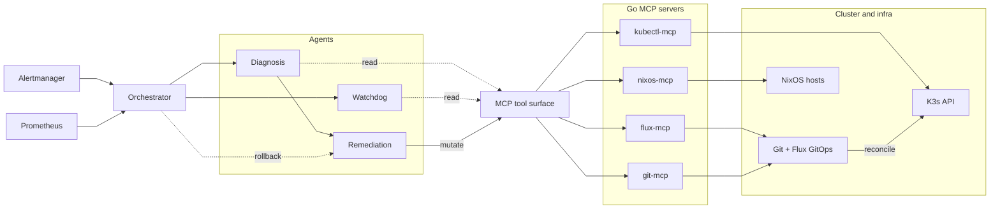

# vigil

[](https://github.com/lucawalz/vigil/actions/workflows/ci.yml)
[](LICENSE)


A multi-agent system for autonomous fault diagnosis and remediation in Kubernetes clusters running on NixOS declarative infrastructure.

## Description

vigil is a system that watches a K3s cluster for faults and repairs them without a human in the loop. When an alert fires, large-language-model agents diagnose the root cause through typed, auditable tool interfaces, apply a fix through GitOps or a NixOS generation switch, and a deterministic watchdog verifies recovery. If the system does not converge to a healthy state, the orchestrator rolls the change back automatically.

The central thesis claim is that the system is reversible by construction: every mutation it can make is an atomic, declarative change that can be undone. Application-layer repairs are commits to Flux-managed manifests, so a revert plus a reconcile restores the prior state. OS-layer repairs are NixOS generation switches guarded by a dead-man's switch, so an uncommitted generation reverts on its own when health is not confirmed. The agents never edit live state in place.

### Features

- Multi-agent diagnosis and remediation built on Pydantic AI, with a non-LLM orchestrator coordinating the workflow.
- MCP-only tool surface: agents reach the cluster, git, and NixOS exclusively through Go MCP servers, never through direct subprocess calls or SSH.
- A deterministic watchdog that observes absolute workload health and carries no LLM, keeping verification cheap and reproducible.
- Dual-layer reversibility through Flux GitOps for Kubernetes and NixOS generations for the OS.
- Dead-man's-switch rollback: an OS generation is durably promoted only after the watchdog confirms health, otherwise the armed timer reverts the host.
- Confidence-tiered autonomy: high-confidence fixes merge automatically, medium-confidence git fixes open a pull request for human review, and low-confidence diagnoses escalate.
- An eval harness with deterministic shell-script fault injection that records a structured RunRecord per run.

### Background

Autonomous remediation is only safe when its actions can be undone. An agent that edits a running system in place leaves no clean path back to the prior state when its diagnosis is wrong. vigil takes the position that declarative infrastructure makes rollback tractable: when the desired state lives in git and is reconciled by Flux, and when OS configuration is expressed as immutable NixOS generations, every repair has a well-defined inverse.

This positioning lets the orchestrator treat remediation as reversible by construction rather than relying on the model to clean up after itself. The work is a bachelor-thesis research project. It evaluates whether LLM-based agents can perform end-to-end fault remediation reliably when constrained to typed, auditable tool interfaces, and whether the Kubernetes-plus-NixOS pairing forms a realistic target for autonomous repair. The design rationale is recorded as architecture decision records under [`docs/adr/`](docs/adr/).

## Architecture



The orchestrator receives an alert, runs diagnosis against the four read-only MCP servers, then dispatches remediation and the watchdog. The watchdog only observes; the orchestrator owns the rollback decision and issues it when the watchdog reports degraded health.

## Requirements

- Python 3.12 with [uv](https://docs.astral.sh/uv/) for the agent and eval workspace.
- Go 1.26 with the workspace defined in `go.work` for the MCP servers.
- The Terraform CLI for provisioning the eval cluster.
- Nix and NixOS for the reversible OS layer and for building cluster node configurations.
- A reachable K3s cluster for live runs.
- An LLM provider, either Anthropic Claude or an OpenAI-compatible endpoint such as Ollama, configured through environment variables only. Credentials are never committed.

The model factory in `agents/common/src/common/provider.py` routes `claude-*` model names to the native Anthropic client and every other name to the OpenAI-compatible endpoint, so switching providers requires only an environment-variable change.

## Installation

Install the Python agent and eval workspace:

```
uv sync
```

Sync the Go workspace and build the MCP servers:

```
go work sync
go build ./...
```

The Hetzner Cloud eval cluster is defined under `infra/terraform`. Provision it with the standard Terraform flow, which also bootstraps Flux:

```
terraform -chdir=infra/terraform init
terraform -chdir=infra/terraform plan
terraform -chdir=infra/terraform apply
```

Cluster node operating systems are defined as NixOS flakes under `infra/nixos` and applied with a NixOS rebuild against the target host. Flux v2 reconciles cluster state from git, so application changes land by committing to the tracked manifests rather than by applying resources directly.

## Usage

Run the Python test suite:

```
uv run pytest
```

Run the Go test suite:

```
go test ./...
```

Run a single scenario against a running orchestrator:

```
uv run vigil-eval run --scenario k8s-1g --seed 1 --model claude-sonnet-4-6
```

Run a full campaign across scenarios, models, and seeds:

```
uv run vigil-eval campaign --models claude-sonnet-4-6 --seeds 1 --seeds 2 --seeds 3
```

Aggregate completed runs into `summary.json`, `REPORT.md`, and `step_summary.md`:

```
uv run vigil-eval aggregate
```

The harness drives one run as inject, then webhook, then orchestration, then a RunRecord JSON written to `eval/runs/`. Each scenario lives in its own directory under `eval/scenarios/` with a `scenario.yaml` describing the expected action and verification, plus `inject.sh` and `reset.sh` scripts that apply and revert the fault deterministically. The `run` command executes one scenario, model, and seed; `campaign` sweeps every combination and pauses cleanly on provider quota exhaustion. Each RunRecord captures outcome, success rate, diagnosis accuracy, mean time to recovery, token and tool-call counts, iteration count, rollback status, and a destructive-repair safety metric. The scenario set spans 13 scenarios across the Kubernetes layer, the OS layer, and cross-cutting boundary cases.

## Repository layout

```
agents/        Python uv workspace: common, orchestrator, diagnosis, remediation, watchdog
mcp-servers/   Go workspace: kubectl-mcp, flux-mcp, git-mcp, nixos-mcp
infra/         terraform, nixos, kubernetes, overlays, policy, packer, local
eval/          harness, scenarios, scripts, results
docs/adr/      architecture decision records
tests/         agent and eval test suites
scripts/       local eval and measurement helpers
```

The `docs/` tree now holds architecture decision records only; the prior prose architecture documents have been removed in favor of the ADRs.

## Roadmap

These are open research directions rather than committed deliverables:

- Complete the frontier-model evaluation campaign with Claude Sonnet 4.6, the upper-bound reference that is currently deferred pending Anthropic API access, so the open-weight results can be compared against a frontier tier.
- Add a Kubernetes live-drift scenario that exercises the `flux_reconcile` remediation action, which the action enum already supports but the current scenario set does not yet cover.

## Contributing

Contributions are welcome. See [CONTRIBUTING.md](CONTRIBUTING.md) for the workflow and conventions, and the architecture decision records under [docs/adr/](docs/adr/) for the reasoning behind the major design choices.

## Support

Open a GitHub issue using the bug-report or feature-request templates under `.github/ISSUE_TEMPLATE/`.

## Authors and acknowledgment

Developed by Luca Walz as a bachelor thesis project.

## License

Released under the MIT License. See [LICENSE](LICENSE).

## Project status

Active research project developed for a bachelor thesis.
