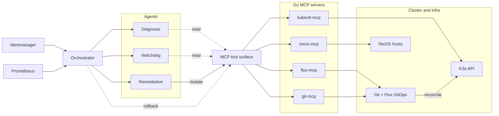

# vigil

[](https://github.com/lucawalz/vigil/actions/workflows/ci.yml)
[](LICENSE)


A multi-agent system for autonomous fault diagnosis and remediation in Kubernetes clusters running on NixOS declarative infrastructure.

## Description

vigil watches a K3s cluster for faults and repairs them without a human in the loop. When an alert fires, large-language-model agents diagnose the root cause through typed, auditable tool interfaces, apply a fix through GitOps or a NixOS generation switch, and a deterministic watchdog verifies recovery. If the system does not converge to a healthy state, the orchestrator rolls the change back automatically.

The central thesis claim is that the system is reversible by construction: every mutation it can make is an atomic, declarative change that can be undone. Application-layer repairs are commits to Flux-managed manifests, so a revert plus a reconcile restores the prior state. OS-layer repairs are NixOS generation switches guarded by a dead-man's switch, so an uncommitted generation reverts on its own when health is not confirmed. The agents never edit live state in place.

### Features

- Multi-agent diagnosis and remediation built on Pydantic AI, with a non-LLM orchestrator coordinating the workflow.
- MCP-only tool surface: agents reach the cluster, git, and NixOS exclusively through Go MCP servers, never through direct subprocess calls or SSH.
- A deterministic watchdog that observes absolute workload health and carries no LLM, keeping verification cheap and reproducible.
- Dual-layer reversibility through Flux GitOps for Kubernetes and NixOS generations for the OS.
- Dead-man's-switch rollback: an OS generation is durably promoted only after the watchdog confirms health, otherwise the armed timer reverts the host.
- Confidence-tiered autonomy: high-confidence fixes merge automatically, medium-confidence git fixes open a pull request for human review, and low-confidence diagnoses escalate.
- An eval harness with deterministic shell-script fault injection that records a structured RunRecord per run.

### Background

Autonomous remediation is only safe when its actions can be undone. vigil takes the position that declarative infrastructure makes rollback tractable: when the desired state lives in git and is reconciled by Flux, and when OS configuration is expressed as immutable NixOS generations, every repair has a well-defined inverse.

The work is a bachelor's thesis research project. It evaluates whether LLM-based agents can perform end-to-end fault remediation reliably when constrained to typed, auditable tool interfaces, and whether the Kubernetes-plus-NixOS pairing forms a realistic target for autonomous repair. The design rationale is recorded as architecture decision records under [`docs/adr/`](docs/adr/).

## Architecture


```mermaid
%%{init: {'flowchart': {'curve': 'linear', 'rankSpacing': 70, 'nodeSpacing': 45}}}%%
flowchart LR
  AM["Alertmanager"] --> OR["Orchestrator"]
  PR["Prometheus"] --> OR

  subgraph ag["Agents"]
    direction TB
    DG["Diagnosis"]
    RM["Remediation"]
    WD["Watchdog"]
  end

  OR --> DG
  OR --> RM
  OR --> WD

  DG -. read .-> MX["MCP tool surface"]
  WD -. read .-> MX
  RM -->|mutate| MX
  OR -. rollback .-> MX

  subgraph mc["Go MCP servers"]
    direction TB
    KM["kubectl-mcp"]
    FM["flux-mcp"]
    GM["git-mcp"]
    NM["nixos-mcp"]
  end

  MX --> KM
  MX --> FM
  MX --> GM
  MX --> NM

  subgraph cl["Cluster and infra"]
    direction TB
    K8["K3s API"]
    GT["Git + Flux GitOps"]
    NX["NixOS hosts"]
  end

  KM --> K8
  FM --> GT
  GM --> GT
  NM --> NX
  GT -->|reconcile| K8
```

The orchestrator receives an alert, runs diagnosis with a read-only subset of the four MCP servers' tools, then dispatches remediation and the watchdog. The watchdog only observes; the orchestrator owns the rollback decision and issues it when the watchdog reports degraded health.

## Installation

Install the toolchain listed in the [prerequisites](CONTRIBUTING.md#prerequisites), or enter the Nix development shell with `nix develop`. Then install every Python workspace package:

```bash
make setup
```

The Go MCP servers need no separate setup step. LLM access is configured through environment variables only: `claude-*` model names use the Anthropic API, every other name an OpenAI-compatible endpoint such as Ollama. Credentials are never committed.

## Usage

Run the full check suite, the same one CI runs:

```bash
make ci
```

Plain `make` runs the same target. Live runs need the Hetzner Cloud eval cluster, provisioned as described in [`infra/terraform/README.md`](infra/terraform/README.md). The local lab in [`infra/lab/`](infra/lab/README.md) runs the cluster hosts as qemu VMs on a laptop or a GitHub runner. Scenarios and evaluation campaigns are covered in [`eval/README.md`](eval/README.md), and running the orchestrator locally in [CONTRIBUTING.md](CONTRIBUTING.md#running-the-orchestrator-locally).

## Repository layout

| Path | Contents |
|------|----------|
| [`agents/`](agents/) | Python uv workspace: common, orchestrator, diagnosis, remediation, watchdog |
| [`mcp-servers/`](mcp-servers/) | Go workspace: kubectl-mcp, flux-mcp, git-mcp, nixos-mcp |
| [`infra/`](infra/) | NixOS hosts, Packer snapshots, Terraform, Flux overlay, RBAC, policy |
| [`eval/`](eval/) | Eval harness, scenarios and helper scripts |
| [`docs/adr/`](docs/adr/) | Architecture decision records |
| [`tests/`](tests/) | Agent and eval test suites |
| [`scripts/`](scripts/) | Local eval, measurement and release helpers |

## Support

Report bugs and request features through the [issue forms](https://github.com/lucawalz/vigil/issues/new/choose). Report vulnerabilities privately as described in [SECURITY.md](SECURITY.md).

## Contributing

Contributions are welcome. See [CONTRIBUTING.md](CONTRIBUTING.md) for the workflow and conventions, and the architecture decision records under [docs/adr/](docs/adr/) for the reasoning behind the major design choices.

## Authors and acknowledgment

Developed by Luca Walz as a bachelor's thesis project.

Parts of this codebase were developed with AI assistance; see [AI-USAGE.md](AI-USAGE.md).

## License

Released under the MIT License. See [LICENSE](LICENSE).

## Project status

Release `v1.0.0` is the version evaluated in the bachelor's thesis and stays unchanged. Development continues on `main`.
