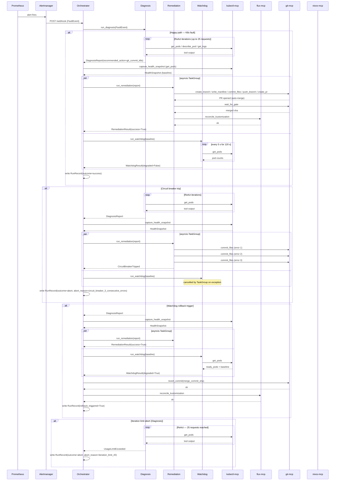

# Vigil — Agent Design

Vigil decomposes autonomous fault diagnosis and remediation into four agents with exclusive responsibilities: an Orchestrator that manages control flow without reasoning about fault semantics, a Diagnosis agent that applies a ReAct loop over read-only Kubernetes and OS state, a Remediation agent that executes repair actions through write-capable MCP tools, and a Watchdog that deterministically monitors cluster health in parallel with remediation. Each agent's context window carries only the information relevant to its task, preventing diagnosis reasoning from bleeding into remediation state and keeping each failure domain isolated.

## Agent Topology

| Agent | Package | Entry Point | Output Type | Tool Scope | LLM? |
|-------|---------|-------------|-------------|------------|------|
| Orchestrator | `agents/orchestrator` | `run_orchestration()` | `RunRecord` | None directly; delegates | No (control only) |
| Diagnosis | `agents/diagnosis` | `run_diagnosis()` | `DiagnosisReport` | kubectl-mcp, nixos-mcp, git-mcp, flux-mcp — all read-only via allow-list `FilteredToolset` | Yes — ReAct, 25-request cap |
| Remediation | `agents/remediation` | `run_remediation()` | `RemediationResult` | git-mcp, flux-mcp, nixos-mcp | Yes — 20-request cap |
| Watchdog | `agents/watchdog` | `run_watchdog()` + `capture_health_snapshot()` | `WatchdogResult` | kubectl-mcp (`get_pods`), flux-mcp (`get_kustomization_status`) | No — deterministic poll loop |

## Orchestrator

The Orchestrator exposes exactly two FastAPI routes: `GET /healthz` and `POST /webhook`. It receives `FaultEvent` objects from two sources: an Alertmanager-shaped webhook on the fast path (`POST /webhook`) and a Prometheus poller that queries `GET /api/v1/alerts` every `PROM_POLL_INTERVAL_S` seconds (default 120). Fingerprint-based deduplication with a `PROM_HANDLED_TTL_S` TTL (default 600 seconds) prevents duplicate dispatch when both paths detect the same alert.

The `run_orchestration()` function drives the complete fault-to-record lifecycle:

1. Ingest `FaultEvent` and generate a `run_id` keyed on scenario, seed, model name, and git SHA.
2. Run the Diagnosis agent to produce a `DiagnosisReport`.
3. Call `capture_health_snapshot()` via Watchdog deps to record the pre-remediation baseline.
4. Launch Remediation and Watchdog in parallel via `asyncio.TaskGroup`.
5. Inspect `WatchdogResult.degraded`: if the cluster remains degraded after a settle window, issue a GitOps rollback through git-mcp `revert_commit` (followed by `flux-mcp.reconcile_kustomization`) for K8s repairs, or `nixos-mcp.switch_generation` for OS repairs. The Orchestrator owns this rollback decision; the Watchdog only observes. See [ADR-0013](../adr/0013-gitops-k8s-remediation.md).
6. Write the final `RunRecord` to `eval/runs/{run_id}.json`.

The Orchestrator holds no LLM agent; it is pure control flow. The decomposition rationale is documented in [ADR-0005](../adr/0005-multi-agent-architecture.md).

## Diagnosis

The Diagnosis agent operates a ReAct [1] loop over read-only cluster, OS, git, and Flux state. Its tool scope is enforced by allow-list `FilteredToolset` wrappers — one per MCP server — that admit only an explicit set of read tools, so any tool not on the list is absent from the agent's tool surface at construction time:

```python
# agents/diagnosis/src/diagnosis/agent.py
def _build_readonly_toolset(server, allowed_tools, blocked_tools):
    return FilteredToolset(
        server,
        filter_func=lambda _ctx, tool_def: is_diagnosis_tool_allowed(
            tool_def.name, allowed_tools, blocked_tools
        ),
    )
```

The four allow-lists are defined in `agents/common/src/common/constants.py`:

- `DIAGNOSIS_KUBECTL_READ_TOOLS`: `get_nodes`, `get_pods`, `describe_pod`, `get_logs`, `rollout_status`, `get_events`, `describe_node`, `get_taints`, `get_resource_yaml`
- `DIAGNOSIS_NIXOS_READ_TOOLS`: `get_generations`, `get_journal`, `get_systemd_status`, `get_nix_path`, `dry_build`
- `DIAGNOSIS_GIT_READ_TOOLS`: `clone_repo`, `read_file`, `resolve_manifest_path`
- `DIAGNOSIS_FLUX_READ_TOOLS`: `get_kustomization_status`, `get_gitrepository_status`

This makes read-only enforcement a structural property, not a prompt convention: a tool name absent from the allow-list never reaches the agent, so the diagnosis phase cannot mutate cluster, git, or OS state regardless of what the model requests.

The Diagnosis agent begins with kubectl-mcp reads and consults nixos-mcp, git-mcp, and flux-mcp as the evidence demands. When the fault implicates a node condition or NixOS service, the agent records the `target_host` value from the alert's `node` label so OS remediation targets the correct node. The Diagnosis agent is capped at 25 requests (`DIAGNOSIS_REQUEST_LIMIT` env var, default 25).

### ReAct Background

The Reason+Act pattern [1] interleaves explicit reasoning traces with action calls, allowing an agent to observe tool outputs and revise its hypothesis before committing to a conclusion. In Vigil's Diagnosis agent, each iteration consists of the agent reasoning about accumulated kubectl or nixos-mcp evidence, selecting the next tool call, observing the output, and updating its working hypothesis. The loop terminates when the agent emits a structured `DiagnosisReport` or the request cap is reached.

This interleaved trace structure is what distinguishes a ReAct agent from a one-shot tool-use call: the agent's intermediate reasoning is visible in the message history, making the diagnosis process auditable per run via the trace files written to `eval/runs/{run_id}/`.

## Remediation

The Remediation agent selects and executes repair actions based on the `DiagnosisReport.requires_os_level` flag. The Pydantic AI `UsageLimits` mechanism enforces a hard cap of 20 requests (see [ADR-0001](../adr/0001-pydantic-ai-agent-framework.md) for the framework choice that supplies this capability).

**K8s path** (`recommended_action=git_commit_k8s`):

The repair is a commit on the manifest in git; Flux reconciliation is the application mechanism. The agent runs the GitOps round-trip `create_branch → write_manifest → commit_files → push_branch → create_pr → wait_for_gate → reconcile_kustomization` via git-mcp and flux-mcp. `wait_for_gate` blocks until the `remediation-gate.yml` workflow merges or rejects the PR; on merge the agent calls `reconcile_kustomization(namespace="flux-system", name="cluster-apps")` to force immediate Flux reconciliation against the merged commit. When the declared state in git is already correct and only the live cluster drifted, the action is `flux_reconcile` and the agent triggers reconciliation without a commit.

**OS path** (`requires_os_level=True`):

1. Skip Flux tooling entirely — no Kustomization is involved in an OS-layer fault.
2. `rebuild_test(host=target_host)` — trial activation of the current NixOS configuration. Success requires both `"nixos-rebuild exit: 0"` and `"k8s-node-ready: True"` in the output.
3. If `rebuild_test` fails: `get_generations` to list available generations, then `switch_generation(host, prev_gen)` to activate the previous generation. `switch_generation` is the primary OS remediation verb validated across the OS and cross-layer eval scenarios.

The `target_host` value (from the alert `node` label) is threaded from `DiagnosisReport` through all nixos-mcp calls, ensuring every OS operation targets the correct node.

## Watchdog

The Watchdog agent runs a deterministic poll loop with no LLM involvement. Its operation divides into two phases within a single run.

Before remediation starts, `capture_health_snapshot()` records the pre-remediation baseline: a `get_pods` call to kubectl-mcp plus a flux-mcp `get_kustomization_status` read produce a `HealthSnapshot` with `ready_pods`, `total_pods`, `endpoints_healthy`, and `flux_ready`. This baseline is passed into `run_watchdog()`.

During remediation, `run_watchdog()` polls `get_pods` every `WATCHDOG_POLL_INTERVAL_S` seconds (default 5) for a window of `WATCHDOG_WINDOW_S` seconds (default 120). Each observation is compared to the baseline: `WatchdogResult(degraded=True)` is returned on the first poll where `ready_pods` falls below baseline or `endpoints_healthy` transitions from `True` to `False`.

Watchdog observes only. It does not call mutation tools and does not issue rollbacks. When `degraded=True` persists past the settle window, the Orchestrator is the decision-maker: it reverts the merged remediation commit via git-mcp `revert_commit` (then `flux-mcp.reconcile_kustomization`) for K8s repairs, or activates the prior NixOS generation via `nixos-mcp.switch_generation` for OS repairs.

## Parallel Remediation and Watchdog

The parallel execution of Remediation and Watchdog is the architectural centerpiece of Vigil's multi-agent design. The two tasks are launched inside a Python 3.11+ `asyncio.TaskGroup`:

```python
# agents/orchestrator/src/orchestrator/agent.py
async with asyncio.TaskGroup() as tg:
    rem_task = tg.create_task(
        run_remediation(remediation_deps, report, model=model)
    )
    wtch_task = tg.create_task(
        run_watchdog(watchdog_deps, baseline)
    )
```

The matching exception handler uses the `except*` syntax introduced alongside `TaskGroup` in Python 3.11:

```python
except* (UsageLimitExceeded, UnexpectedModelBehavior, CircuitBreakerTripped) as eg:
    raise eg.exceptions[0]
```

`asyncio.TaskGroup` provides structured concurrency semantics that `asyncio.gather` does not. When any child task raises an exception, the `TaskGroup` immediately cancels all remaining sibling tasks and aggregates all exceptions into an `ExceptionGroup`. The `except*` clause then consumes the `ExceptionGroup` and re-raises the first exception for the Orchestrator to handle.

The practical consequence for Vigil is deterministic failure handling: if Remediation hits the circuit breaker or the request cap, the Watchdog poll loop is cancelled immediately rather than continuing to accumulate observations against a remediation that has already aborted. The Orchestrator receives a single exception rather than a partial result paired with a still-running task. Using `asyncio.gather` would require explicit cancellation logic and expose a window where the Watchdog continues polling after the Remediation future has settled, producing a race between the gather result and the Watchdog's next poll.

## Circuit Breaker

The `_CircuitBreaker` class in `agents/orchestrator/src/orchestrator/agent.py` counts consecutive MCP tool errors. At 3 consecutive errors it raises `CircuitBreakerTripped`, which propagates out of the `asyncio.TaskGroup` as described above.

Request caps are enforced at the Pydantic AI `UsageLimits` layer independently of the circuit breaker:

- Diagnosis: 25 requests (`DIAGNOSIS_REQUEST_LIMIT` env var, default 25)
- Remediation: 20 requests (`UsageLimits(request_limit=20)`, fixed)

When either cap is exceeded, Pydantic AI raises `UsageLimitExceeded`. The Orchestrator's `except UsageLimitExceeded` handler in `agent.py` writes a `RunRecord` with `outcome="abort"` and `abort_reason="iteration_limit_20"`. The abort string `"iteration_limit_20"` is a fixed literal in the codebase derived from the Remediation agent's cap; it also applies when the Diagnosis 25-request cap triggers the exception. This is an implementation naming quirk and carries no architectural significance.

All dependency structs (`OrchestratorDeps`, `DiagnosisDeps`, `RemediationDeps`, `WatchdogDeps`) are frozen dataclasses, ensuring no shared mutable state between agents during a run. The one session-level stateful object is the flux-mcp server's `suspendedNames` map, which lives in the Go process and is therefore isolated to the server boundary.

## Fault Handling — Sequence Diagram



## References

[1] S. Yao, J. Zhao, D. Yu, N. Du, I. Shafran, K. Narasimhan, and Y. Cao, "ReAct: Synergizing Reasoning and Acting in Language Models," in *Proc. 11th Int. Conf. Learning Representations (ICLR)*, 2023. Available: https://arxiv.org/abs/2210.03629
