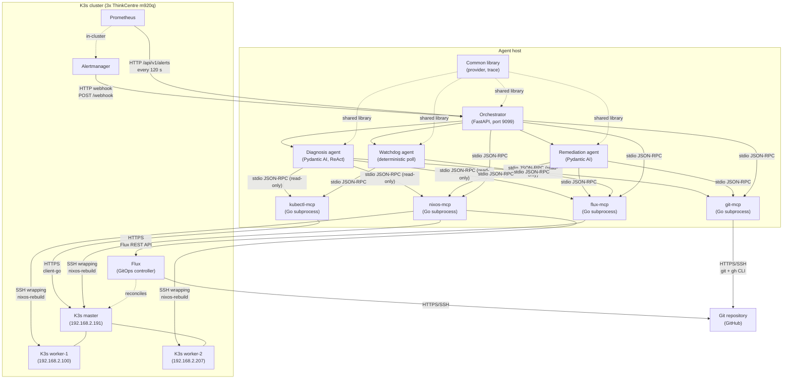
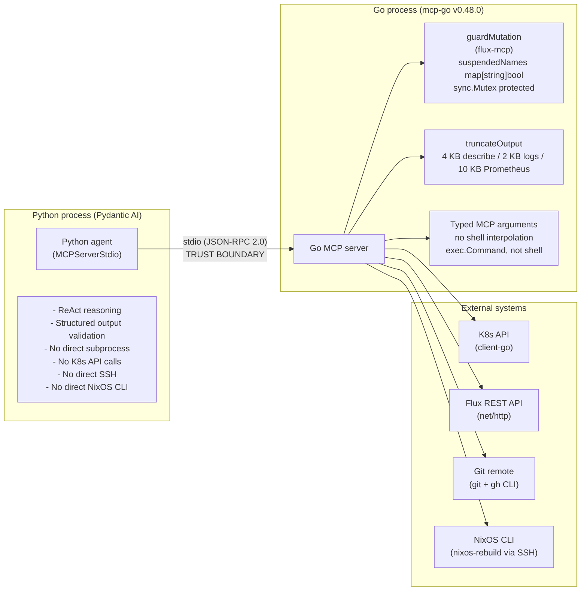

# Vigil — System Overview

Vigil is a multi-agent system for autonomous fault diagnosis and remediation in Kubernetes clusters
running on NixOS declarative infrastructure. The thesis argument it supports rests on three pillars:
first, that LLM-based agents can perform end-to-end fault remediation reliably when constrained to
typed, auditable tool interfaces; second, that declarative infrastructure (NixOS generations and
Flux-managed GitOps) is the enabling substrate for corrigibility, because every OS mutation is an
atomic, reversible generation switch rather than an in-place edit; and third, that the combination
of Kubernetes at the application layer and NixOS at the OS layer provides a sufficiently realistic
target for autonomous remediation to be meaningful. The architecture described here is not a
forward-looking design sketch; it is a description of a system
evaluated through fault-injection campaigns on a Hetzner Cloud cluster provisioned via Terraform and orchestrated by GitHub Actions.

## System Topology

The system consists of four Python agents running on an external agent host, four Go MCP servers
spawned as child processes of those agents, and a three-node K3s cluster. The agent host is
deliberately external to the cluster: OS-level faults that render cluster nodes unresponsive cannot
take the agent down with them. All cluster interactions flow through the MCP servers via the stdio
transport; no Python agent code calls the Kubernetes API, SSH, or NixOS CLI directly
(see [ADR-0002](../adr/0002-mcp-exclusive-tool-surface.md)).



The MCP servers are long-lived child processes started once during the FastAPI lifespan and reused
across all requests. Each agent receives its relevant MCP clients through a frozen dependency
dataclass (`DiagnosisDeps`, `RemediationDeps`, `WatchdogDeps`, `OrchestratorDeps`), preventing
shared mutable state across agent boundaries. The Prometheus poller runs as a background
`asyncio.Task` inside the same FastAPI process and uses fingerprint-based deduplication with a
configurable TTL (default 600 s) to avoid dispatching the same fault twice.

## MCP Security Boundary

The trust boundary in Vigil is the stdio pipe between a Python agent and its corresponding Go MCP
server. The Python layer performs LLM reasoning and structured output validation; it never touches
the Kubernetes API, SSH transport, or NixOS CLI directly. The Go layer enforces correctness
constraints that the LLM cannot circumvent: mutation guards, command allowlists, and output
truncation. This separation means that even a misbehaving model cannot bypass the enforcement
mechanisms, because they execute in a separate process under a different runtime
(see [ADR-0002](../adr/0002-mcp-exclusive-tool-surface.md) and
[ADR-0003](../adr/0003-go-mcp-servers.md)).



`guardMutation` is a middleware function in `flux-mcp` that rejects any mutating tool call unless
the target Kustomization name is present in a `suspendedNames map[string]bool`, protected by a
`sync.Mutex`. The `suspend_kustomization` tool is the only one not wrapped by `guardMutation`; it
is the enabler that registers a name in the set. This means `suspend_kustomization` must be the
first call before any Flux mutation, not by agent convention but by server-side enforcement. The
`truncateOutput` function caps responses at 4 KB for describe output, 2 KB for logs, and 10 KB for
Prometheus data, appending `[TRUNCATED: N lines omitted]` when clipping occurs. Together these
mechanisms bound both the blast radius of a mistaken mutation and the context window growth from
verbose tool responses [1].

## End-to-End Fault Handling

Vigil operates in one of two trigger modes. The fast path is an Alertmanager webhook: when
Alertmanager fires, it sends `POST /webhook` to the Orchestrator's FastAPI endpoint, which
immediately constructs a `FaultEvent` and enters `run_orchestration()`. The slow path is the
Prometheus poller: an `asyncio.Task` running inside the FastAPI lifespan issues `GET /api/v1/alerts`
every 120 seconds (configurable via `PROM_POLL_INTERVAL_S`) and dispatches any alert whose
fingerprint has not been seen within the deduplication TTL. The poller catches alerts that
Alertmanager may have delivered during a restart window, making the trigger reliable under
transient connectivity failures between Alertmanager and the agent host.

`run_orchestration()` first calls `run_diagnosis()` with a `DiagnosisDeps` dataclass carrying all
four read-only clients: `kubectl_mcp`, `nixos_mcp`, `git_mcp`, and `flux_mcp`. The Diagnosis agent
runs a ReAct [2] loop capped at 25 requests (`DIAGNOSIS_REQUEST_LIMIT`). Each client is wrapped in
an allow-list `FilteredToolset` that admits only the read tools enumerated in
`agents/common/src/common/constants.py`; any tool not on the allow-list is absent from the agent's
surface, making the diagnosis phase structurally read-only regardless of what the model requests.
When the fault implicates a node condition or NixOS service, the `target_host` field (populated
from the alert's `node` label) is propagated to all subsequent `nixos-mcp` calls in the remediation
phase. The two-tier escalation is a design-time separation: K8s-layer faults are resolved without
touching NixOS; OS-layer faults require the escalated path
(see [ADR-0005](../adr/0005-multi-agent-architecture.md) for the multi-agent decomposition
rationale).

Before spawning the parallel remediation and monitoring tasks, the Orchestrator calls
`capture_health_snapshot()` to record a `HealthSnapshot` baseline. This baseline is passed to the
Watchdog so it can detect health degradation relative to a known pre-remediation state rather than
an assumed-clean state. The parallel phase uses Python 3.11+ `asyncio.TaskGroup`:

```python
async with asyncio.TaskGroup() as tg:
    rem_task = tg.create_task(run_remediation(remediation_deps, report, model=model))
    wtch_task = tg.create_task(run_watchdog(watchdog_deps, baseline))
```

`asyncio.TaskGroup` cancels all sibling tasks when any one raises, preventing a hung Watchdog from
blocking indefinitely after a Remediation abort. Per-agent design rationale and the fault-handling
sequence diagram appear in `agent-design.md`.

The Remediation agent follows two distinct paths depending on the `DiagnosisReport`. On the K8s
path, the repair is a commit to the manifest in git, applied by Flux. The agent runs the GitOps
round-trip via `git-mcp` and `flux-mcp` — `create_branch → write_manifest → commit_files →
push_branch → create_pr → wait_for_gate → reconcile_kustomization` — so cluster state converges to
the merged commit on `main` (see [ADR-0013](../adr/0013-gitops-k8s-remediation.md)). On the OS
path, the agent corrects either the live host (via a NixOS rebuild) or the declared config in git
(via a commit on the NixOS manifest), targeting the host named in `target_host`. The dead-man's
switch that enforces this flow at the OS level is treated in depth in
[gitops-nixos.md](gitops-nixos.md).

The Watchdog runs a deterministic poll loop (5-second interval, 120-second window) using
`kubectl get pods` via `kubectl-mcp` and a `flux-mcp` Kustomization-status read. It carries no LLM
and makes no decisions; it observes. When the window expires or degradation is detected, it returns
a `WatchdogResult`. If `WatchdogResult.degraded=True` persists past the settle window, the
Orchestrator (not the Watchdog) issues the rollback: for K8s repairs it reverts the merged commit
via `git-mcp.revert_commit` followed by `flux-mcp.reconcile_kustomization`; for OS repairs it
activates the prior NixOS generation via `nixos-mcp.switch_generation`. This separation of
observation from decision is intentional: the Orchestrator has full context of the remediation
attempt; the Watchdog does not.

Two abort mechanisms interrupt the normal flow. The circuit breaker (`_CircuitBreaker` class in
`orchestrator/agent.py`) counts consecutive MCP tool errors; at 3, it raises
`CircuitBreakerTripped` and the `asyncio.TaskGroup` propagates it via `except*` handling. The usage
limit abort fires when any LLM-bearing agent exhausts its request budget (`UsageLimitExceeded`
from Pydantic AI); the resulting `RunRecord.outcome` value is `"iteration_limit_20"`, a string
fixed in the codebase that reflects Remediation's 20-request limit but is emitted for any agent
that hits its ceiling. Both aborts produce a `RunRecord` written to
`eval/runs/{run_id}.json`, the canonical output of every orchestration run.

## Component Reference

| Component | Language | Tools / Role | LLM-bearing |
|-----------|----------|-------------|-------------|
| Orchestrator | Python 3.12 | Workflow control, circuit breaker, FastAPI webhook | No |
| Diagnosis | Python 3.12 | ReAct loop, allow-list `FilteredToolset` read-only scope over all four servers | Yes (25 req limit) |
| Remediation | Python 3.12 | GitOps K8s path + OS path execution | Yes (20 req limit) |
| Watchdog | Python 3.12 | Deterministic health poll, baseline delta | No |
| Common | Python 3.12 | Shared provider, trace utilities | — |
| kubectl-mcp | Go (mcp-go v0.48.0) | `get_nodes`, `get_pods`, `describe_pod`, `describe_node`, `get_logs`, `get_events`, `get_taints`, `get_resource_yaml`, `rollout_status`, `delete_resource` | No |
| flux-mcp | Go (mcp-go v0.48.0) | `reconcile_kustomization`, `get_kustomization_status`, `get_gitrepository_status` | No |
| git-mcp | Go (mcp-go v0.48.0) | `create_branch`, `write_manifest`, `commit_files`, `push_branch`, `create_pr`, `get_pr_status`, `wait_for_gate`, `revert_commit`, `close_pr`, `delete_branch` — GitOps remediation and rollback | No |
| nixos-mcp | Go (mcp-go v0.48.0) | `get_generations`, `switch_generation`, `rebuild_test`, `trigger_reconcile`, `get_journal`, `get_systemd_status`, `get_nix_path`, `dry_build`, `etcd_snapshot_save` | No |

The choice of Go for all four MCP servers is justified in
[ADR-0003](../adr/0003-go-mcp-servers.md): single static binary, no Python runtime dependency,
access to `client-go`, `crypto/ssh`, and `net/http` from the standard library. The MCP-only tool
surface constraint (the rule that no Python agent code invokes subprocess or shell commands
directly) is the subject of [ADR-0002](../adr/0002-mcp-exclusive-tool-surface.md).

## References

[1] Anthropic, "Model Context Protocol Specification," revision 2024-11-05. Available: https://spec.modelcontextprotocol.io/specification/2024-11-05/

[2] S. Yao, J. Zhao, D. Yu, N. Du, I. Shafran, K. Narasimhan, and Y. Cao, "ReAct: Synergizing Reasoning and Acting in Language Models," in *Proc. 11th Int. Conf. Learning Representations (ICLR)*, 2023. Available: https://arxiv.org/abs/2210.03629
